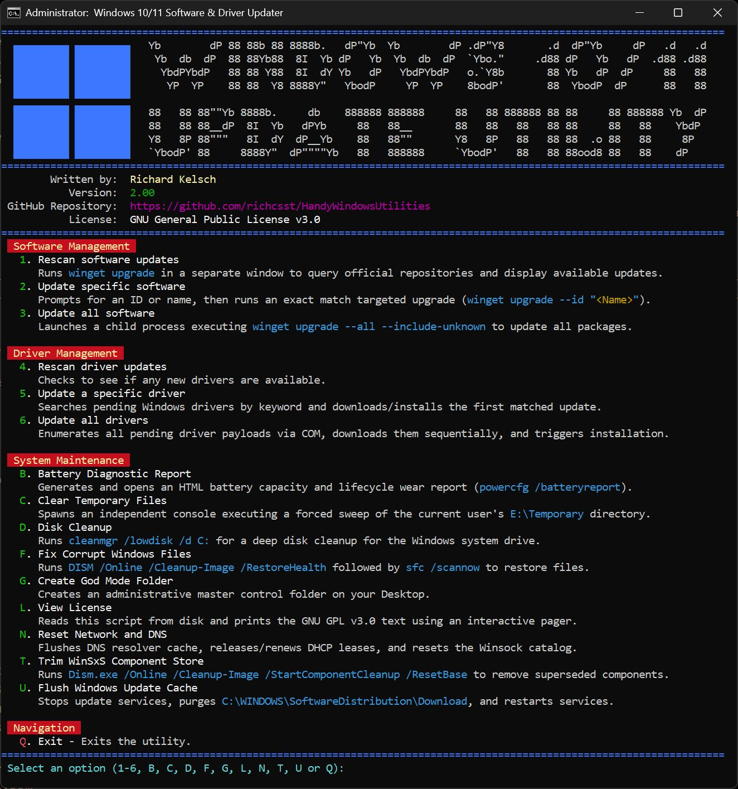

# Handy Windows Utilities

These utilities make Windows 11 easy to use without third party software, that usually charge a subscription.  These utilities utilize built-in Windows commands and capability that likely those subscribed tools use as well.

Just place the file on your desktop and double-click to run it.  Answer YES to the administrator prompt.

## Software and Driver Updater.cmd

This simple script shows a menu where you can scan for available updates for software and drivers.

